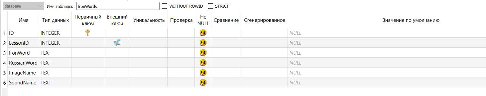

# Название проект: Осетинский Duolingo

## Автор проекта: Мамсуров Абисал Таймуразович

## Аннотация(Идея проекта):

Данные проект для помощи в изучении Осетинского языка людьми проживающими на территории
Российской Федерации и/или знающие русский язык. Программа имеет несколько интерактивных упражений для изучения языка.
Данный проект предназначен для операционных систем windows 10-11. Целевая аудитория проекта люди в возрасте от 6 лет.

## Техническое задание(что нужно реализовать?):

* Графический интерфейс
* Возможность экспортировать общий словарь слов имеющийся в Базе Данных
* Наличие нескольких уроков по различным темам(например: животные, предметы)
* Наличие интерактивных заданий, а именно:
* Тест по различным осетинским словам
* Сопоставление картинки со словами на осетинском языке
* Составление предложений на осетинском из данных слов
* Перевод предложений с осетинского
* Написание предложений на слух
* Сделать сохранение количества пройденных курсов
* Сделать авторизацию для сохранения данных о пройденных курсах

# Руководство администратора

## Что нужно для запуска приложения?

В папке с exe файлом должны также находится база данных **"database.sqlite"** и папка **Images** с изображениями
используемыми в программе

## Как запустить проект?

Достаточно просто открыть файл "**ironduo.exe**"

# Руководство пользователя

## Первое основное окно "Авторизации":

Здесь всё просто имеется два поля одно предназначенною для ввода логина пользователя, а второе нижнее для ввода пароля.
Также имеется кнопка "авторизоваться" думаю с понятным функционалом.

В случае отсутствия аккаунта имеется кнопка выделенная синим текстом: "у меня нет аккаунта" по нажатию которой
открывается окно регистрации


## Второе окно "Регистрация":

В данном окне имеется четыре поля для ввода текста, сюда надо вводить данные указанные над полями. Также имеется
кнопка "зарегистрироваться", которая регистрирует пользователя и перекидывает обратно на окно "Авторизация"


## Третье окно "Основное окно":

Здесь же функционала больше. Справа находятся данные о пользователе его имя и фамилия, количество пройденных им уровней
и его уровень(не доделан). Также имеется кнопка выйти, которая закрывает программу и выходит из аккаунта.

Слева же находится основной функционал этого окна здесь имеется выпадающий список с названиями уроков, а снизу кнопка "
Выбрать урок", открывающее окно урока. Также имеется кнопка "Экспортировать словарь в csv", которая экспортирует все
слова имеющиеся в базе данных в csv файлик.


## Четвёртое окно "Окно урока":

В данном окне имеется несколько различных упражнений с инструкциями по их выполнению, но у каждого из упражнений снизу
есть три кнопки: "Проверить", "Предыдущее задание", "Следующее задание". При нажатии на первую проверяются результаты
выбранные в упражнении, при нажатии двух других вы перемещаетесь между упражнениями.


# Руководство программиста

## Окно авторизации:

В данном окне имеется класс **MainAutorization**, в котором прописан весь основной функционал окна он наследуется от
класса интерфейса **Ui_AuthorizationForm**. Класс имеет основную функцию **auth_button_clicked**, которая считывает
введённые данные и проверяет их со значениями в ДБ:

```python

def auth_button_clicked(self):
    username = self.loginTextBox.text()
    password = self.passwordTextBox.text()
    query = f"""SELECT * FROM Users WHERE Username='{username}' AND password='{password}'"""

    con = sqlite3.connect('database.sqlite')
    cursor = con.cursor()

    authorizated_user_info = cursor.execute(query).fetchall()

    if len(authorizated_user_info) == 0:
        self.error_msg = QMessageBox()
        self.error_msg.setWindowTitle('Ошибка')
        self.error_msg.setText('Неверное имя пользователя или пароль')
        self.error_msg.show()
        return

    self.statusBar().showMessage('Авторизация успешна')
    self.user_id = authorizated_user_info[0][0]

    con.commit()
    con.close()
    self.open_main_window()
```

## Окно регистрации:

Здесь аналогично окну "авторизация" используется класс **MainRegistration**, наследуемый от класса интерфейса
**Ui_RegistrationForm**. Здесь основной функции является **registration_button_clicked**, которая проверяет данные из
база данных и в случае, если пользователь не зарегистрирован добавляет его в базу данных:

```python

def registration_button_clicked(self):
    try:
        name = self.nameTextBox.text()
        check_name(name)
        surname = self.surnameTextBox.text()
        check_surname(surname)
        username = self.loginTextBox.text()
        check_username(username)
        password = self.passwordTextBox.text()
        check_password(password)

        query = f"""INSERT INTO Users (ID, Username, Password, Firstname, Secondname) VALUES (Null, '{username}', '{password
        }', '{name}', '{surname}')"""

        con = sqlite3.connect('database.sqlite')
        cursor = con.cursor()

        cursor.execute(query)
        con.commit()
        con.close()
        self.open_auth_form()
    except NameNotCorrect:
        self.error_message.setText("Имя должно быть не более 2-х символов и состоять только из букв.")
        self.error_message.show()
        return
    except SurnameNotCorrect:
        self.error_message.setText("Фамилия должна быть не более 2-х символов и состоять только из букв.")
        self.error_message.show()
        return
    except UsernameLengthNotCorrect:
        self.error_message.setText("Логин должен быть не менее 5 символов.")
        self.error_message.show()
        return
    except UsernameIsOccupied:
        self.error_message.setText("Логин уже занят.")
        self.error_message.show()
        return
    except PasswordNotCorrect:
        self.error_message.setText("Пароль должен быть не менее 8 символов.")
        self.error_message.show()
        return
```

Также тут используются собственно сделанные исключения такие как: PasswordNotCorrect, UsernameIsOccupied,
UsernameLengthNotCorrect, SurnameNotCorrect, NameNotCorrect

## Основное окно

В данном окне функционал уже более разнообразен, основным классом окна выступает **MainWindow**, а классом его
интерфейса **Ui_MainWindow**. Также тут реализован основной класс урока **Lesson**
в этом классе хранятся данные об упражнениях, а именно в переменной **task_classes**
Также там хранится ID пользователя, который был передан из предыдущего окна.

```python
class Lesson:
    def __init__(self, name_of_lesson, task_classes, user_id, main_window_ref):
        self.name_of_lesson = name_of_lesson
        self.task_classes = task_classes
        self.user_id = user_id
        self.main_window_ref = main_window_ref

    def generate_lesson(self):
        initialize_lesson(self.name_of_lesson, self.task_classes, self.user_id, self.main_window_ref)
        return True
```

Помимо этого там имеется функция generate_lesson, отвечающая за генерацию всех упражнений урока.

Вернёмся к классу основного окна тут имеется 4 основные функции: **export_words, initial_update_info,
update_info_about_levels, open_lesson**

### Функция export_words:

Данная функция срабатывает при нажатии кнопки "Экспортировать словарь в csv". Она считывает данные из ДБ и записывает в
csv
файл.

```python
def export_words(self):
    fname = str(QFileDialog.getExistingDirectory(self, "Select Directory"))

    conn = sqlite3.connect('database.sqlite')
    cur = conn.cursor()

    query1 = f"SELECT IronWord, RussianWord FROM IronWords"

    words = cur.execute(query1).fetchall()

    with open(fname + '/words_dictionary.csv', 'w', newline='', encoding='utf-8') as csvfile:
        writer = csv.writer(csvfile, delimiter=';')
        writer.writerow(['Осетинское слово', 'Русский перевод'])
        writer.writerows(words)

    conn.commit()
    conn.close()

    self.statusBar().showMessage("Слова экспортированы в words .csv")
```

### Функция initial_update_info:

Данная функция вызывается только при инициализации окна "**MainWindow**", она собирает данные о имени, фамилии и
количестве пройденных уроков пользователя.

```python
def initial_update_info(self):
    conn = sqlite3.connect('database.sqlite')
    cur = conn.cursor()
    query1 = f"SELECT PassedLesson FROM PassedLessons WHERE PassedUser = {self.user_id}"

    count_of_lessons = len(cur.execute(query1).fetchall())

    query2 = f"SELECT Firstname, Secondname FROM Users WHERE ID = {self.user_id}"

    firstname, secondname = cur.execute(query2).fetchall()[0]

    conn.commit()
    conn.close()

    self.nameAndSurnameLabel.setText(f"{firstname} {secondname}")

    self.lessonCompletedLabel.setText(str(count_of_lessons))
```

### Функция update_info_about_levels:

Данная функция выполняет похожую на предыдущую функцию, но она не собирает данные об имени, фамилии пользователя и нужна
исключительно для обновления информации о пройденных уроках.

```python
def update_info_about_levels(self):
    conn = sqlite3.connect('database.sqlite')
    cur = conn.cursor()
    query1 = f"SELECT PassedLesson FROM PassedLessons WHERE PassedUser = {self.user_id}"

    count_of_lessons = len(cur.execute(query1).fetchall())

    self.lessonCompletedLabel.setText(str(count_of_lessons))

    conn.close()
```

### Функция open_lesson:

Судя по названию можно понять, что нужна она для открытия урока по нажатию кнопки: "**Выбрать урок**":

```python
def open_lesson(self):
    lesson_name = self.lessonsComboBox.currentText()

    # Открытие урока
    if self.lessons[lesson_name].generate_lesson():
        self.hide()
```

Функция **generate_lesson** была Ранне упомянута в пункте [Основное окно](#Основное-окно)

## Окно урока

В это окне основных классов окна несколько для каждого типа упражнений. На данный момент их два: **LessonWindowTest**,
**LessonWindowImages** наследуемые соответственно от классов интерфейса **Ui_LessonWindow**, **Ui_LessonWindowImages**.
Также имеется основной класс урока **MainLesson**. В нём описаны все упражнении хранящиеся в уроке.

```python
class MainLesson:
    def __init__(self, name_of_lesson, tasks):
        self.tasks = tasks
        self.name_of_lesson = name_of_lesson
        self.task_references = list()
```

### Класс LessonWindowTest

Здесь надо поподробнее в этом классе одна из главных переменных **answers** в ней хранятся данные об ответах на
упражнения в заданиях.

Также имеется функция **generate_task**, которая предназначена для генерации урока. Она обращается к Базе данных и
считывает от туда данные для урока, реализованно это в функции **read_database_info**:

```python
def read_database_info():
    conn = sqlite3.connect('database.sqlite')
    cur = conn.cursor()
    query = f"SELECT * FROM IronWords WHERE LessonID = 1"
    word_list_from_db = sample(cur.execute(query).fetchall(), 4)
    conn.commit()
    conn.close()

    return word_list_from_db
```

Далее эта функция генерирует урок, а точнее создаёт текст и список выпадающих слов с результатами

```python
def generate_task(self, main_lesson_ref, user_id, main_window_ref):
    # Считываем данные с ДБ
    word_list_from_db = read_database_info()

    # Заполняем словарь словами и переводами из БД
    for word in word_list_from_db:
        self.answers[word[2]] = word[3]

    self.main_window_ref = main_window_ref
    self.lesson_ref = main_lesson_ref
    self.user_id = user_id
    iron_words_for_generate = list(self.answers.keys())
    shuffle(iron_words_for_generate)
    russian_words_for_generate = list(self.answers.values())
    shuffle(russian_words_for_generate)

    for i in range(len(iron_words_for_generate)):
        label = QLabel(self)
        label.setText(iron_words_for_generate[i])
        label.setAlignment(QtCore.Qt.AlignmentFlag.AlignRight)
        some = QComboBox(self)
        some.addItems(russian_words_for_generate)

        self.russian_words.append(some)
        self.iron_words.append(label)

        horizontal_layout = QHBoxLayout(self)
        horizontal_layout.addWidget(label)
        horizontal_layout.addStretch()
        horizontal_layout.addWidget(some)
        self.allWordsVerticalLayout.addLayout(horizontal_layout)
```

Также имеется функция **check_answers**, которая проверяет ответы данные пользователем с теми которые даны в переменной
**answers**

```python
def check_answers(self):
    for i in range(len(self.iron_words)):
        if self.answers[self.iron_words[i].text()] == self.russian_words[i].currentText():
            self.iron_words[i].setStyleSheet("QLabel { background-color: rgb(48, 255, 93); }")
        else:
            self.iron_words[i].setStyleSheet("QLabel { background-color: rgb(252, 20, 63); }")

    self.sender().setVisible(False)
    for i in self.russian_words:
        i.setEnabled(False)

    if self.id_of_task != len(self.lesson_ref.tasks) - 1:
        self.nextTaskButton.setEnabled(True)
    else:
        self.stopLessonButton.setVisible(True)
```

### Класс LessonWindowTest

В этом классе аналогично имеется переменная **answers**, хранящая ответы на упражнения.

Также имеется функция **generate_task**, которая аналогично генерирует урок:

```python
def generate_task(self, main_lesson_ref, user_id, main_window_ref):
    # Инициализируем переменные
    self.main_window_ref = main_window_ref
    self.lesson_ref = main_lesson_ref
    self.user_id = user_id

    # Считываем данные с ДБ
    word_list_from_db = read_database_info()

    # Заполняем словарь словами и переводами из БД
    for word in word_list_from_db:
        self.answers[word[4]] = word[2]

    # Создание интерфейса
    for i in range(len(self.answers.keys())):
        image_name = str(list(self.answers.keys())[i])
        label = QLabel(self)
        label.setAlignment(QtCore.Qt.AlignmentFlag.AlignCenter)
        pixmap = QPixmap('Images/' + image_name)
        label.setPixmap(pixmap)
        verticallayout = QVBoxLayout()
        verticallayout.addWidget(label)

        allwords = QComboBox(self)
        allwords.addItems(sample(list(self.answers.values()), 4))
        verticallayout.addWidget(allwords)

        self.answers_refs[image_name] = allwords

        self.horizontalLayout.addLayout(verticallayout)
```

Данные также считываются из базы данных как в пункте [ссылочка](#Класс-LessonWindowTest)

Аналогичная функция проверки ответов **check_answers**:

```python
def check_answers(self):
    for i in range(len(self.answers_refs.values())):
        image_name, combobox = list(self.answers_refs.keys())[i], list(self.answers_refs.values())[i]

        if combobox.currentText() == self.answers[image_name]:
            combobox.setStyleSheet("background-color: rgb(48, 255, 93);")
        else:
            combobox.setStyleSheet("background-color: rgb(252, 20, 63);")

    self.sender().setVisible(False)

    for i in list(self.answers_refs.values()):
        i.setEnabled(False)

    if self.id_of_task != len(self.lesson_ref.tasks) - 1:
        self.nextTaskButton.setEnabled(True)
    else:
        self.stopLessonButton.setVisible(True)
```

### Основной функционал окна

Основной функцией генерации урока является функция **initialize_lesson**, которая вызывается из
окна [Основное окно](#Основное-окно)

```python
def initialize_lesson(lesson_name, tasks_of_lesson, user_id, main_window_ref):
    global lesson
    lesson = MainLesson(lesson_name, tasks_of_lesson)
    for task_id in range(len(lesson.tasks)):
        task_ref = eval(tasks_names[lesson.tasks[task_id]] + '(lesson_name, task_id)')
        task_ref.generate_task(lesson, user_id, main_window_ref)
        lesson.task_references.append(task_ref)

    lesson.task_references[0].show()
```

## База данных


Таблица **IronWords**


Таблица **Lessons**


Таблица **PassedLessons**


Таблица **Users**


# Заключение

В заключении хотелось бы сказать, что не всё из задуманного удалось сделать. Для окончания проекта стоит добавить больше
упражнение, чем 2. Пополнить базу данных словами и добавить больше разных тем.

# Список используемой литературы и сайтов

- Yandex GPT
- https://doc.qt.io/qtforpython-5/contents.html
- lms.yandex.ru

**Проект подготовлен для Яндекс Лицея курс 2**
